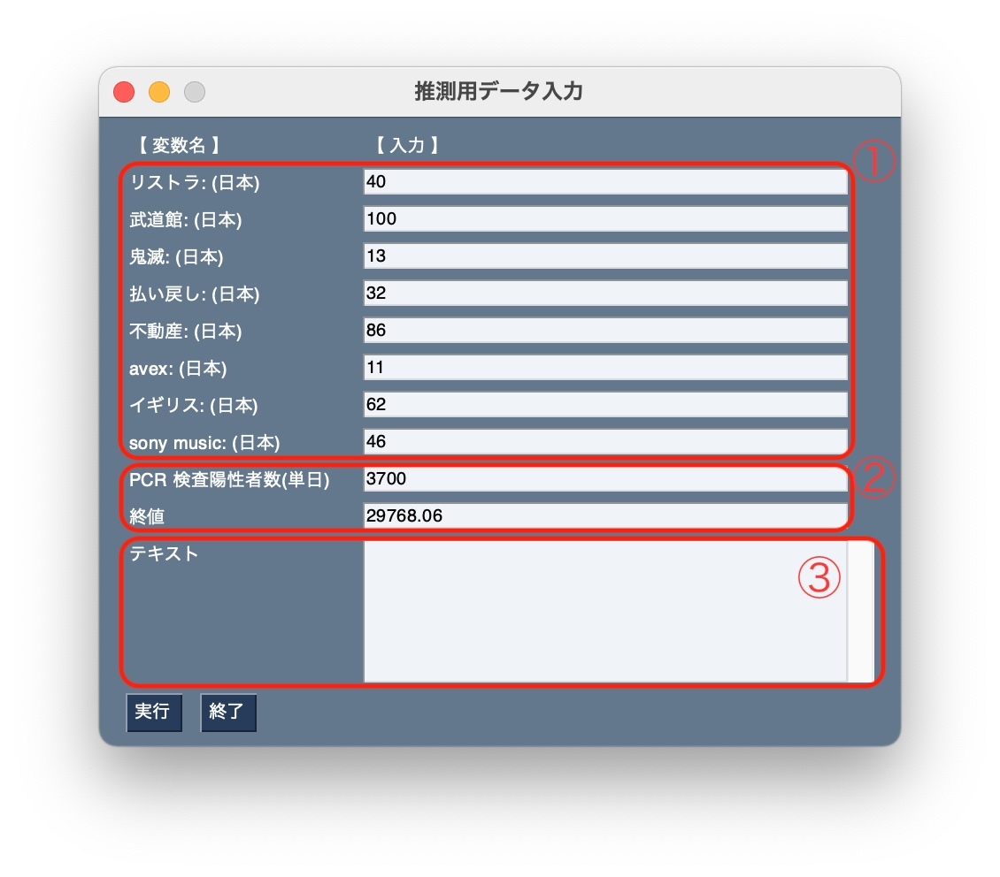
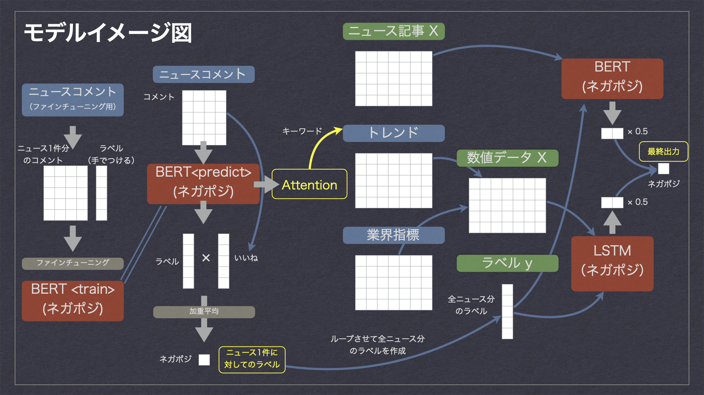

# BERT Marketing System

これは自然言語処理モデルのBERTを用いたディープラーニング・マーケティングモデルです。  
自社の未発表のプレスリリースと関連データを入力するとプレスリリースに対する読者の反応を推測します。

# Quick Start

学習済みのモデルが用意してありますので、試しに動かしたいという方はこちらを実行してください。  
（データ収集や学習の仕方はUser's Manualにあります。）

一例として新型コロナ関連の音楽ニュースとそれに関連する数値データを学習させてあります。  
指定の数値データとコロナ禍における音楽ビジネス施策に関するプレスリリーステキストを入力すると、その施策に対する世間の反応を推測して出力します。

1. QuickStartモデルのダウンロード

    リポジトリをクローンしたフォルダに移動し、以下のコマンドを実行

    wget "https://www.dropbox.com/s/omq1tjiplf735so/quick_start_model_BERT.zip"

    unzip quick_start_model_BERT.zip

    （git-hubの容量制限の問題によりBERTモデルをgitにあげることができなかったため、上記手順によりダウンロードをお願いします。）

2. 日本語学習済みモデルをダウンロードする

    以下の学習済みモデルを利用しているため、下記URLにアクセスしGoogleドライブへのリンクから「bert-wiki-ja」フォルダをダウンロードして ./downloads フォルダへ入れる。

    https://yoheikikuta.github.io/bert-japanese/

3. 必要なライブラリのインストール

    以下のコマンドを実行  
    pip install -r requirements.txt  
    cat requirements_aptitude.txt | xargs sudo apt install -y

    以下のコマンドを実行し、mecabの辞書をインストールする  
    git clone https://github.com/neologd/mecab-ipadic-neologd.git  
    cd mecab-ipadic-neologd  
    sudo bin/install-mecab-ipadic-neologd -n -a  
    (yesまたはnoを尋ねられたらyesを入力する)

4. リポジトリのフォルダにもどりターミナルから python quick_start.py を実行

    数秒待つと入力フォームが表示されるのでそれまで待機する  
    

5. 入力フォームに当日の各種データを入力する

    以下の値をインターネット等で確認して入力する。  
    （使用感を確かめたいだけであれば適当な数値で構いません。また、あくまでQuickStart用に選んだ数値ですので、実際には項目を自由に選んで学習させることが可能です。）

6. 入力フォームに予測したいプレスリリースの文章を入力

    プレスリリースがない場合はネットニュースの記事などを貼り付ける

7. 実行ボタンを押す

    数秒後に予測結果がポップアップで出力されるので結果を確認する（PositiveまたはNegative）。  
    確認したら終了ボタンをクリック。

    続けて推測したい場合はデータを入力し直して実行ボタンをクリック。
    終了する場合は終了ボタンをクリックする。

作業完了

# What is the BERT Marketing System

このプログラムは自社のプレスリリースとそれに関連する時系列指標データを入力するとプレスリリースに対する一般消費者の反応の予測を出力するプログラムです。

例えば以下のような課題解決に活用できます
- 自社の新しい施策に対しての反応が気になる
- プレスリリースの文章表現中にネガティブな印象を与える要素がないか確認したい
- マーケティングにインターネット上の情報を活用したい

消費者の反応が予測できればテキスト表現の修正や、場合によってはその施策内容の変更、実施可否の判断を行うことができます。

このモデルでは一般消費者の反応の予測はPositiveまたはNegativeで返されます。

ネガポジ判定は各種AutoMLでも可能ですが、このモデルの強みはテキストだけでなく関連する数値データと組み合わせて推測することができる点です。

消費者が受ける印象はそのテキストの内容だけで決まるわけではありません。  
消費者はその時々の社会情勢を背景知識として持っており、そのフィルターを通してそのテキストから何らかの印象を受け取ります。  
同じテキストを読んでも背景が異なれば全く別の反応をしかねません。

そこで、テキスト情報だけでなく、そのテキストと関連する社会情勢を反映したデータも判定に用いることにしました。
そして、データセット作成のためにBERTモデルのSelf-Attention層の重みをExcelで書き出し、ネガポジ判定の根拠を可視化するようにしました。  
重みがかかっている単語がその文のキーワードであると解釈できますので、そのキーワードの検索トレンドの数値などを取得して特徴量として使用することができます。

### モデル概要

このモデルは２段階のモデルになっています。

```bash
- First stage
	- BERT（Keras_BERT）
		- 事前学習済みモデルをファインチューニング
		- テストデータの推測を利用して各ニュースに対してのラベル付け
		- Self-Attention抽出によるキーワード把握

- Second stage
	- LSTM & BERT Ensemble（Keras & Keras_BERT）
		- ニューステキストと各数値指標（トレンドや業界関連データ）による時系列学習と予測
```



First stageでBERTのファインチューニングを行い、推測時にSelf-Attentionを抜き出します。  
抜き出したSelf-Attentionからキーワードを把握し、それを元にSecond stageのデータセットを集めます。  
Second stageでニューステキストとそれに関連する数値データを使ってネガポジ推測モデルを学習します。

また、ラベル付けの工数を削減するために、試みとしてBERT自身に自動でラベルを作成させるモデルにしてみました。  
Second stage用のラベルを前半の処理で作成しています。

### データセット

利用するためにはまず学習用のデータを集める必要があります。

このモデルは２段階のモデルになっており、それぞれの段階において以下の学習データが必要です。

```bash
- First stage
	- ニュース記事のテキスト（数十件）
	- そのニュースに対するコメントのテキスト（全て）

- Second stage
	- キーワード（Second stageの出力）のトレンドデータ
	- 事業に関連する指標の時系列データ（いくつか）
```

データ収集については、インターネットでニュース記事とそれに対するコメントをテキストファイルで取得します。（下記マニュアル 1. 参照）  
著作権法上、データ分析を目的とする複製は認められています。  
しかし、自動取得を規約で許可していないサイトもありますので、収集方法としては対象のニュースページを開いて、内容をコピー＆ペーストすることになると思います。

### 注意点

このモデルを利用するにあたって、以下の問題点を考慮する必要があります。
- 判定したいプレスリリースごとに学習し直さないといけない  
  データ収集で数日、学習・推測で数時間かかるため、効果に対してコストがかかりすぎる
- 標本に偏りがある  
  ニュースにコメントを書く人はネガティブな印象を抱いている傾向が強く、本来知りたい一般消費者の標本として相応しいとは言えない


# User's Manual

1. ニュース記事・コメント収集

    ニュースの記事とコメントをコピーしてテキストファイルで保存(任意のフォルダへ)。

    以下の形式で保存すること（番号は001から始まる通し番号にする）。  

    - ニュース
    ```bash
    タイトル
    ○/○(曜日) XX:XX配信
    ニュース本文
    ```
    ```bash
    news_text_001.txt  
    news_text_002.txt  
    news_text_003.txt  
    ...
    ※番号は001から始まる通し番号
    ```

    - コメント

    ```bash
    ユーザーID | ○/○(曜日) XX:XX
    コメント本文

    返信○

    good
    bad
    ユーザーID | ○/○(曜日) XX:XX
    コメント本文

    返信○

    good
    bad
    ...
    ```
    ```bash
    comment_text_001.txt  
    comment_text_002.txt  
    comment_text_003.txt  
    ...
    ※番号は001から始まる通し番号（ニュース記事と対応させること）
    ```

2. ファイルをフォルダに振り分ける

    ./datasets_text フォルダ内に以下の様に振り分ける（ファイル名は変更しないこと）。  

    - finetuning
      - BERTのファインチューニング用
    - pred_labelingfinetuning
      - LSTMの学習用（ラベリングはBERTが行う）

    ```bash
    ./datasets_text  
      └─ finetuning   
        └─ test  
          └─ comments  
            └─ comment_text_xxx.txt  
            └─ comment_text_xxx.txt  
          └─ news  
            └─ news_text_xxx.txt  
            └─ news_text_xxx.txt  
        └─ train  
          └─ comments  
            └─ comment_text_xxx.txt  
            └─ comment_text_xxx.txt  
          └─ news  
            └─ news_text_xxx.txt  
            └─ news_text_xxx.txt  
      └─ pred_labeling  
        └─ comments  
          └─ comment_text_xxx.txt  
          └─ comment_text_xxx.txt  
        └─ news  
          └─ news_text_xxx.txt  
          └─ news_text_xxx.txt  
    ```

3. プログラムで表に変換（csv出力）

    python make_csv.py を実行する。  

    ./datasets_csv フォルダにファイルが作成されたことを確認する。

4. ファインチューニング用のラベルを作成する

    ./datasets_csv/finetuning/train/comments および ./datasets_csv/finetuning/test/comments 内のファイルを開きそれぞれのコメントに対応するラベルをつける。
    作成したファイルを ./datasets_csv/finetuning/train/labels、./datasets_csv/finetuning/test/labels へ保管する。  

    ファイル名は以下の形式に従う。

    ```bash
    comment_labels_001.csv  
    comment_labels_002.csv  
    comment_labels_003.csv  

    ```

    ファイルの中は以下の形式で記載する。

    |  label  |
    | ---- |
    |  positive  |
    |  negative  |
    |  positive  |
    |  negative  |
    |  positive  |
    |  negative  |

5. 日本語学習済みモデルをダウンロードする

    以下の学習済みモデルを利用しているため、下記URLにアクセスしGoogleドライブへのリンクから「bert-wiki-ja」フォルダをダウンロードして ./downloads フォルダへ入れる。

    https://yoheikikuta.github.io/bert-japanese/

6. 必要なライブラリのインストール

    以下のコマンドを実行  
    pip install -r requirements.txt  
    cat requirements_aptitude.txt | xargs sudo apt install -y

    以下のコマンドを実行し、mecabの辞書をインストールする  
    git clone https://github.com/neologd/mecab-ipadic-neologd.git  
    cd mecab-ipadic-neologd  
    sudo bin/install-mecab-ipadic-neologd -n -a  
    (yesまたはnoを尋ねられたらyesを入力する)

7. python main_BERT.py を実行

    BERTの学習に時間がかかるため、AWS EC2 などのGPU環境で実行することが望ましい。

8. python pred_BERT.py を実行

        以下のファイルが作成されたか確認する。
        - ./datasetsフォルダ内のX_trainおよびy_train
        - ./attention_excel/self_attention.xlsx

        ※ ラベルy_trainはモデルが作成しているため、誤ったラベル付けがなされている可能性がある。  
        中身を確認して明らかにおかしい場合には対応するニュースコメントを確認しながら手直しで修正する。

9. Self-Attention（キーワード）の確認

    ./attention_excel/self_attention.xlsxを開き、 各ニュース記事に対応したシートを確認。  
    Self-Attention層の重みの数値が高いセルが赤く着色される。  
    重みの数値が高くなっている単語がネガポジ判定により寄与した単語と考えられるため、その単語の前後の文脈からキーワードを探し出す。  

10. 関連する時系列データの取得

    インターネットから関連データを取得する。

    - Googleトレンドデータの取得  
    Googleトレンドで上記キーワードのトレンドを一つずつ表示し、csvにてダウンロードして ./associated_data/multiTimeline に保管する。  

    - その他の指標のデータ  
    任意のデータを取得して ./associated_data/Industry_indicator_data に保管する。

11. 上記 9. の手順で取得したIndustry_indicator_dataを以下の形式に変形する  
    （ファイル作成方法のサンプルがEdit_Tabledata.ipynbにあります）

    ファイル名：./associated_data/dataframe_indicator_index.csv  
    形　　　式：ファイルの中は以下の形式で記載する。

      |  date  |  feature_name  |  feature_name  |
      | ---- | ---- | ---- |
      |  YYYY-MM-DD  |  int or float  |  int or float  |
      |  YYYY-MM-DD  |  int or float  |  int or float  |
      |  YYYY-MM-DD  |  int or float  |  int or float  |
      |  YYYY-MM-DD  |  int or float  |  int or float  |
      |  YYYY-MM-DD  |  int or float  |  int or float  |
      |  YYYY-MM-DD  |  int or float  |  int or float  |

      ※ feature_nameは任意の特徴量名

12. python main_LSTM_ensemble.py を実行する

13. python pred_LSTM_ensemble.py を実行する

    ネガポジ判定結果を確認する。


作業完了
