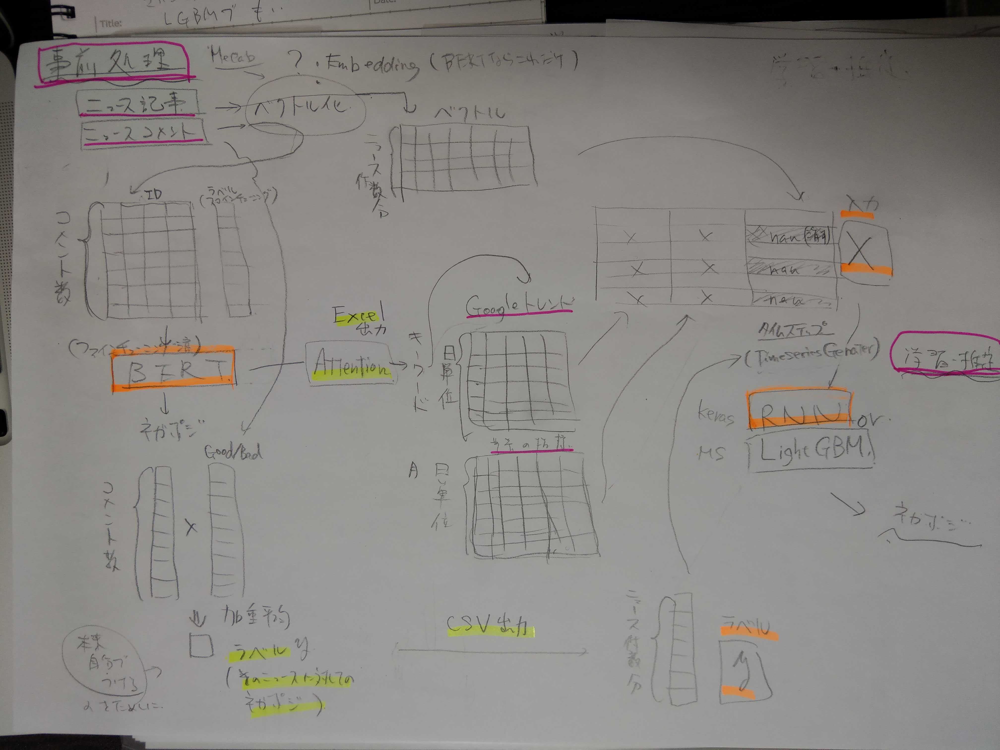

# BERT Marketing System

This is the Marketing Machine Learning Model that used BERT.

# Quick Start

1. テキスト集め


    Yahoo!ニュースの記事とコメントをコピーしてテキストファイルに貼り付けて保存(任意のフォルダへ)。

    以下の形式で保存すること（番号は001から始まる通し番号にする）。  

    ```bash
    news_text_001.txt  
    news_text_002.txt  
    news_text_003.txt  
    comment_text_001.txt  
    comment_text_002.txt  
    comment_text_003.txt  
    ```

2. ファイルをフォルダに振り分ける

    ./datasets_text フォルダ内に以下の様に振り分ける（ファイル名は変更しない）。  

    - finetuning
      - BERTのファインチューニング用
    - pred_labelingfinetuning
      - LSTMの学習用（ラベリングはBERTが行う）


    ./datasets_text  
    &emsp;└─ finetuning   
    &emsp;&emsp;└─ test  
    &emsp;&emsp;&emsp;└─ comments  
    &emsp;&emsp;&emsp;&emsp;└─ comment_text_xxx.txt  
    &emsp;&emsp;&emsp;&emsp;└─ comment_text_xxx.txt  
    &emsp;&emsp;&emsp;└─ news  
    &emsp;&emsp;&emsp;&emsp;└─ news_text_xxx.txt  
    &emsp;&emsp;&emsp;&emsp;└─ news_text_xxx.txt  
    &emsp;&emsp;└─ train  
    &emsp;&emsp;&emsp;└─ comments  
    &emsp;&emsp;&emsp;&emsp;└─ comment_text_xxx.txt  
    &emsp;&emsp;&emsp;&emsp;└─ comment_text_xxx.txt  
    &emsp;&emsp;&emsp;└─ news  
    &emsp;&emsp;&emsp;&emsp;└─ news_text_xxx.txt  
    &emsp;&emsp;&emsp;&emsp;└─ news_text_xxx.txt  
    &emsp;└─ pred_labeling  
    &emsp;&emsp;└─ comments  
    &emsp;&emsp;&emsp;└─ comment_text_xxx.txt  
    &emsp;&emsp;&emsp;└─ comment_text_xxx.txt  
    &emsp;&emsp;└─ news  
    &emsp;&emsp;&emsp;└─ news_text_xxx.txt  
    &emsp;&emsp;&emsp;└─ news_text_xxx.txt  


3. プログラムで表に変換（csv出力）

    以下のファイルを実行する。

    - make_news_csv.py
    - make_comments_csv.py

    ./datasets_csv フォルダにファイルが作成されたことを確認する。

4. ファインチューニング用のラベルを作成する

    ./datasets_csv/finetuning/test/comments 内のファイルを開きそれぞれのコメントに対応するラベルをつける。  
    ファイル名は以下の形式に従う。

    ```bash
    comment_labels_001.csv  
    comment_labels_002.csv  
    comment_labels_003.csv  

    ```

    ファイルの中は以下の形式で記載する。

    |  label  |
    | ---- |
    |  positive  |
    |  negative  |
    |  positive  |
    |  negative  |
    |  positive  |
    |  negative  |

5. 日本語学習済みモデルをダウンロードする

    以下の学習済みモデルを利用しているため、下記URLにアクセスしGoogleドライブへのリンクから「bert-wiki-ja」フォルダをダウンロードして ./downloads フォルダへ入れる。

    https://yoheikikuta.github.io/bert-japanese/


6. 設定ファイルを変更

    ./downloads/bert-wiki-ja_config 内の’bert_finetuning_config_v1.json’を開く。  

    最大単語数を必要に応じて変更する。  

    ```bash
    "max_position_embeddings": 300,  
    "max_seq_length": 300,  
    ```

    最大単語数は「Sprint26_卒業課題_Keras_BERT_AWS.ipynb」及び「Sprint26_卒業課題_Keras_BERT_local.ipynb」内の変数 ’max_token_num’ として出力される。  
    実行中に変更の必要性が出た場合、その都度変更する。


6. BERTのNotebookを実行

    用途に応じて以下のいづれかのファイルを使用。

    - Sprint26_卒業課題_Keras_BERT_AWS.ipynb
    - Sprint26_卒業課題_Keras_BERT_local.ipynb  

    全ての処理が完了した後、 ./datasets フォルダ内に y_train.csv が作成されていることを確認する。

8. Self-Attention（キーワード）の確認

    ./attention_excel フォルダに各ニュース記事に対応した'.xlxs'ファイルが作成されるので、開いて中身を確認する。  

    ```bash
    attention_001.xlsx  
    attention_002.xlsx  
    attention_003.xlsx  
    ```

    Self-Attention層の重みの数値が高くなっている単語がネガポジ判定に寄与した単語と考えられるため、その単語の前後の文脈からキーワードを探し出す。  

9. 関連する時系列データの取得

    インターネットから関連データを取得する。

    - Googleトレンドデータの取得  
    Googleトレンドで上記キーワードのトレンドを一つずつ表示し、csvにてダウンロードして ./associated_data/multiTimeline に保管する。  

    - その他の指標のデータ  
    任意のデータを取得して ./associated_data/multiTimeline に保管する。  
    (「Sprint26_卒業課題_Keras_RNN.ipynb」に読み込みやテーブル化するコードを追加してください。)


10. RNNのNotebookを実行する

    以下のファイルを実行する。

    - Sprint26_卒業課題_Keras_RNN.ipynb

    ファイル内のネガポジ判定結果を確認する。


作業完了

# What is the BERT Marketing System

このプログラムは自社のプレスリリースとそれに関連する時系列指標データを入力するとプレスリリースに対する一般消費者の反応の予測を出力するプログラムです。

一般消費者の反応の予測はPositiveまたはNegativeで返されます。

ネガポジ判定は各種AutoMLでも可能ですが、このモデルの強みはテキストだけでなく関連する数値データを組み合わせて推測することができる点です。

このモデルは２段階のモデルになっています。

モデル概要

```bash
- First stage
	- BERT（Keras）
		- 事前学習済みモデルをファインチューニング
		- 推測を利用した各ニュースに対してのラベル付け（ネガポジ）
		- Self-Attention抽出によるキーワード把握

- Second stage
	- LSTM（Keras）
		- ニューステキストと各数値指標（トレンドや業界関連データ）の同時入力による時系列学習と予測
```



利用するためにはまず取得したデータをこのモデルに学習させる必要があります。

このモデルは２段階のモデルになっており、それぞれの段階において以下の学習データが必要です。

```bash
- First stage
	- ニュース記事のテキスト（数十件）
	- そのニュースに対するコメントのテキスト（全て）

- Second stage
	- キーワード（Second stageの出力）のトレンドデータ
	- 事業に関連する指標の時系列データ（いくつか）
```

# User's Manual
